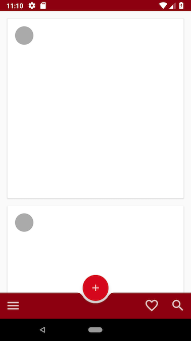

## App Bottom Bar

### Dependencies and Android versions
```
android {
    compileSdkVersion 28
    defaultConfig {
        minSdkVersion 15
        targetSdkVersion 28
        ...
    }
    ...

}

dependencies {
    implementation 'androidx.core:core-ktx:1.0.0-alpha3'
    implementation 'androidx.constraintlayout:constraintlayout:1.1.2'
    implementation 'com.google.android.material:material:1.0.0-alpha3'
}
```

### Screenshot
